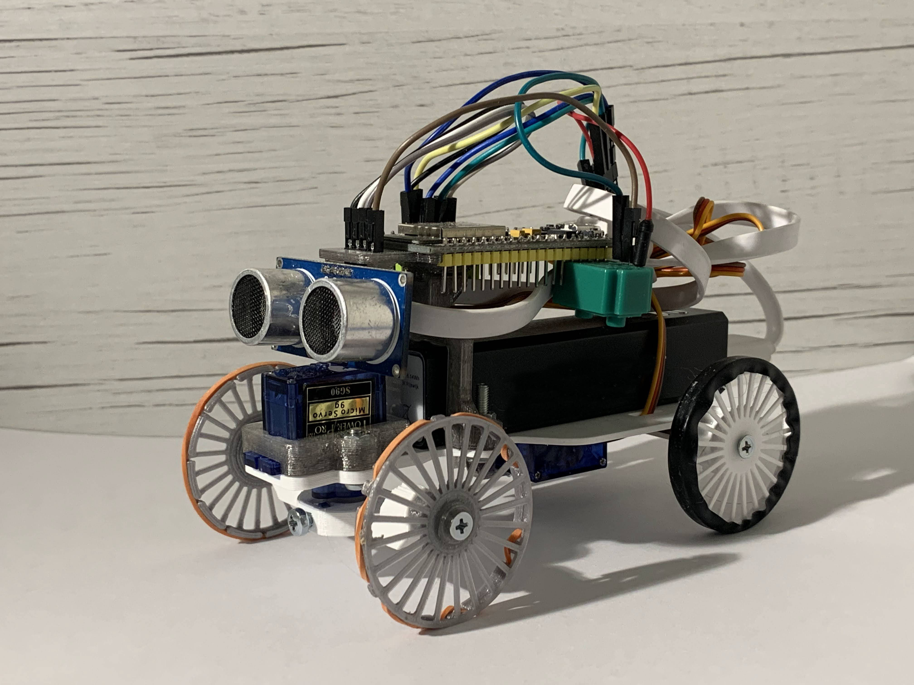
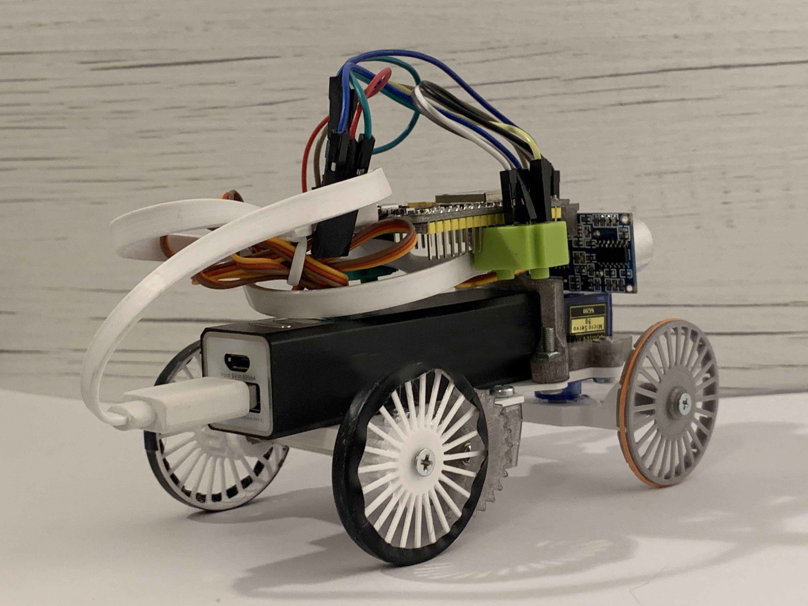

# LightRover (cz)

LightRover je minimalistický robot vyvinutý za účelem podpory výuky a popularizace techniky. Mezi jeho vlastnosti patří
* nízká cena materiálu
* jednoduchost stavby pouze pomocí šroubováku
* použití pouze běžně dostupných kutilských komponent (kromě 3D tisku)
* minimum přípravných prací ze strany organizátora
* absence plošného spoje
* bezpečnost díky napání powerbankou
* elektrická odolnost (lze zničit pouze stabilizátor napětí)
* minimální objem 3D tisku
* programování jako Arduino
* knihovna se srozumitelným rozhraním
* demo umožňující dálkové ovládání z libovolného chytrého zařízení

Seznam materiálu
* Nepájivé pole mini 3x
* Servo SG90 180deg 1x
* Servo SG90 360deg 1x
* Ultrazvukový senzor HC-SR04 1x
* Dupont propojka samec-samice 4x
* Dupont propojka samec-samec 6x
* Distanční sloupek M3 50mm 1x
* MicroUSB datový kabel 1x
* Křížový šroubovák PH1 1x
* Powerbanka hranatá 18650 1x
* ESP32 DevKitC nebo podobný 1x
* Šroub M3x20 4x
* Šroub M3x10 6x
* Matice M3 8x
* 3D tisk (FDM) 35g

## Licence
* Obsah tohoto repozitáře mimo složku *Software* je sdílen pod licencí [Attribution-NonCommercial-ShareAlike 4.0 International (CC BY-NC-SA 4.0)](https://creativecommons.org/licenses/by-nc-sa/4.0/).
* Obsah složky *Software* je sdílen pod licencí [GNU Lesser General Public License v3.0](https://www.gnu.org/licenses/lgpl-3.0.en.html).

## License
* The contents of this repository excluding folder *Software* is shared under license [Attribution-NonCommercial-ShareAlike 4.0 International (CC BY-NC-SA 4.0)](https://creativecommons.org/licenses/by-nc-sa/4.0/).
* The contents of the folder *Software* is shared under license [GNU Lesser General Public License v3.0](https://www.gnu.org/licenses/lgpl-3.0.en.html).

